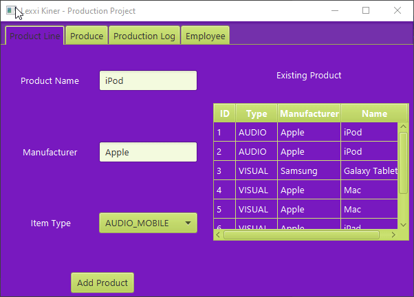
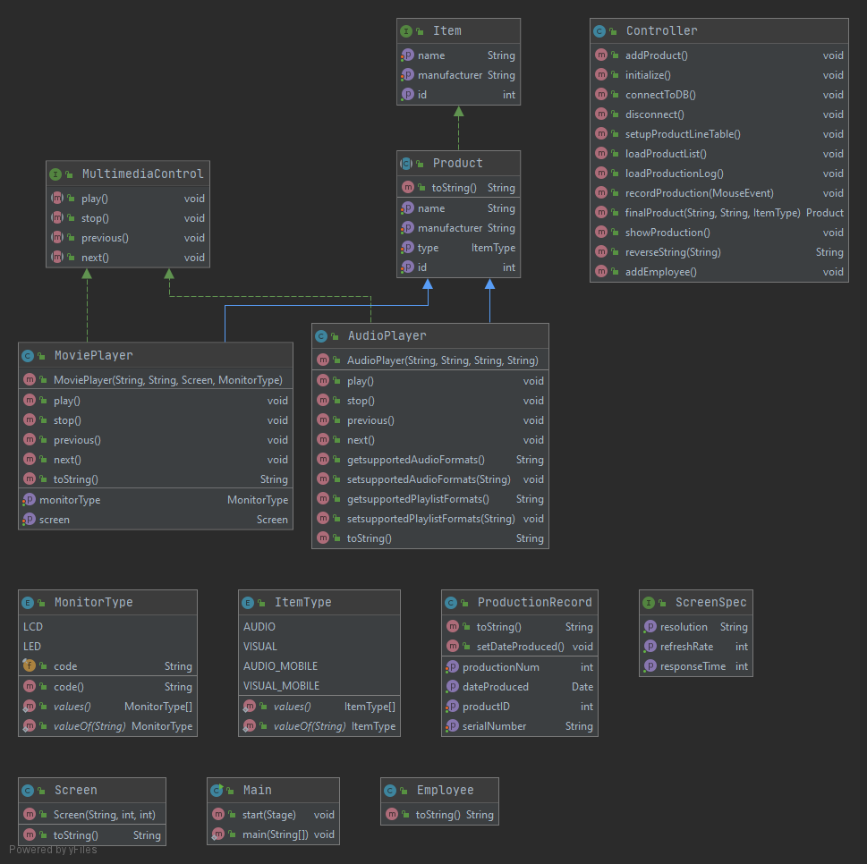

# Production
The goal of this project is to create a software for a media player production facility that will make the jobs of the workers more efficient. We are working to automate
the process by allowing the workers to input the items, and the software stores the information into a database along with a list of the items that are able to be produced
by the facility. Workers can log in to the system and get a username and password. I made this project independently in my Object Oriented Programming class in the Fall 2020 semester at Florida Gulf Coast University. Previous to working on this project, I had a little work with Java and Object-Oriented Programming. During the creation of this project, I learned more about the language and the style of programming. I did this project because it was our assigned semester long project. I created this project in my dorm room while taking all of my classes online. The project shows my growth and development with Object-Oriented Program because we were given freedom with different aspects of the development of the program.

## Demonstration
 

## Documentation
[JavaDocs Reference](lexxikiner.github.io/Production/allclasses.html)

## Diagrams
 

## Getting Started
In order to get the project running, download all the files. Run the program through the main class. The graphical user interface will appear allowing you to interact with the product databases and employee attributes.

## Built With
I used the IntelliJ IDEA 2020 IDE to develop my program. It helped me with running and debugging my program. I utilized SceneBuilder to make my GUI more user-friendly. 

## Contributing
You contribute to this project by furthering the developing the program the employees implement the new items or search for the previously inputted items. The security of the program could be increased by needing an admin log in before interacting and seeing the employee logins.

## Author
Lexxi Kiner

## License
 

## Acknowledgments
I used Professor Vanselow as a resource along with our Teaching Assistants when I needed help. 

## History
12/11/2020 - This is my first public release of this project

## Key Programming Concepts Utilized
Object-Oriented Programming was heavily used when creating this program. 
